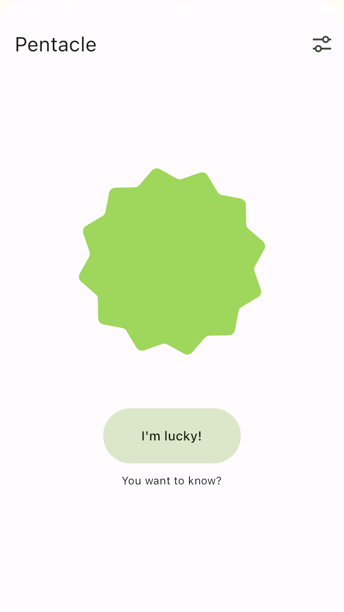
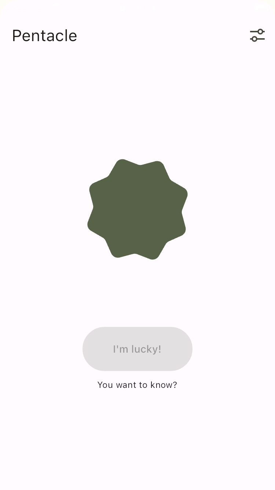
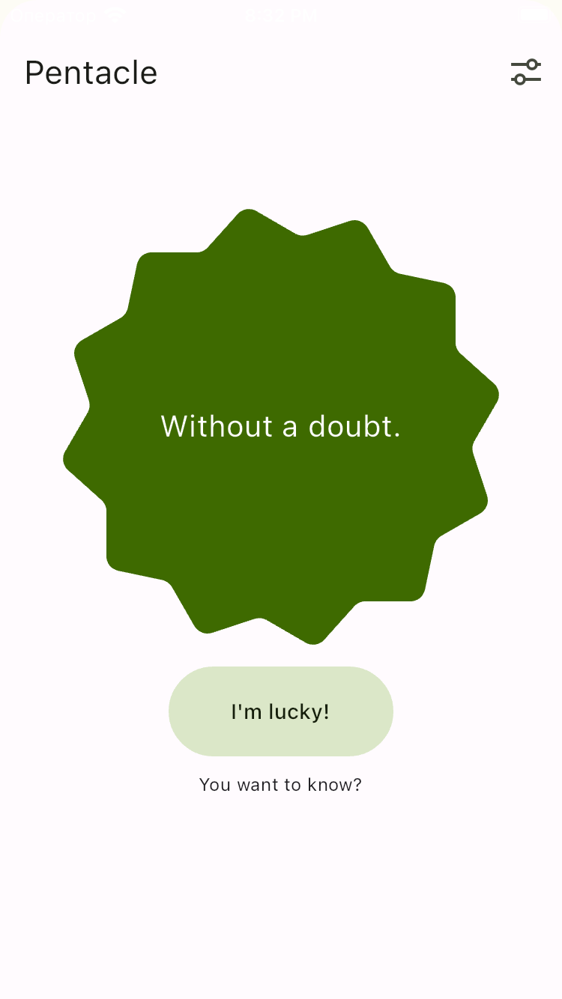
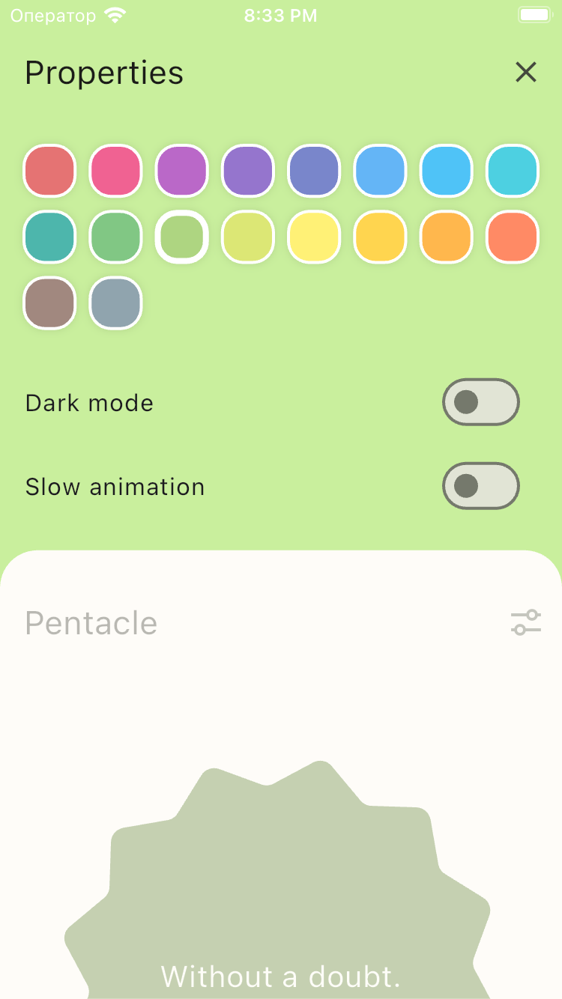
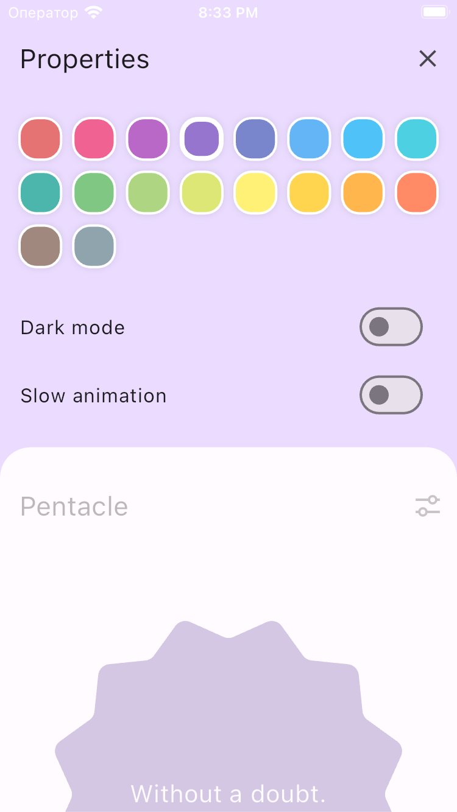
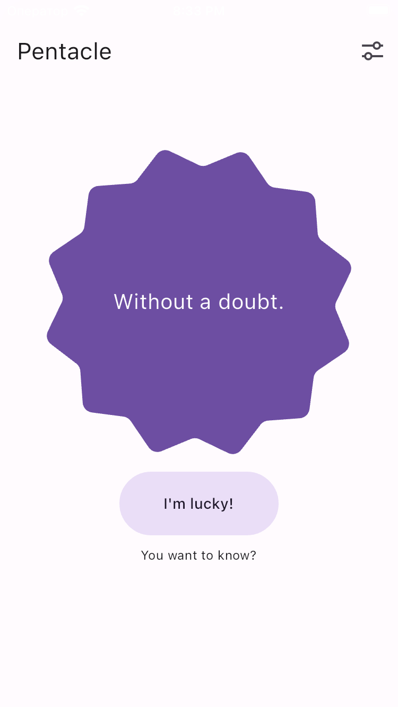
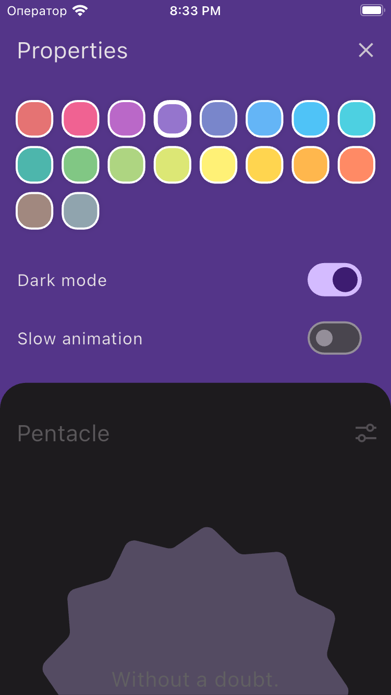

# Целевая платформа

Проверено на симуляторе iPhone 8

# Результаты

Решил просто реализовать свою идею из головы, не смотря на задания, в итоге получилось что-то такое:

- Начальный экран с фигурой, которая вращается и видоизменяется в зависимости от состояния
- Кнопка для получения предсказания
- Скрытое меню с настройками темы и замедления анимаций

Используется BLoC для управления состоянием приложения.

# Ссылки на демонстрацию работы/скриншоты

<video src="docs/assets/8.mp4" width="250">

## Видео

https://github.com/mocki-toki/surf-flutter-study-jam-4/assets/115447460/3af3eb92-b3cb-4aa7-baee-005b29bec881

## Скачать APK

https://github.com/mocki-toki/surf-flutter-study-jam-4/blob/study-jam-4/docs/assets/app-release.apk
